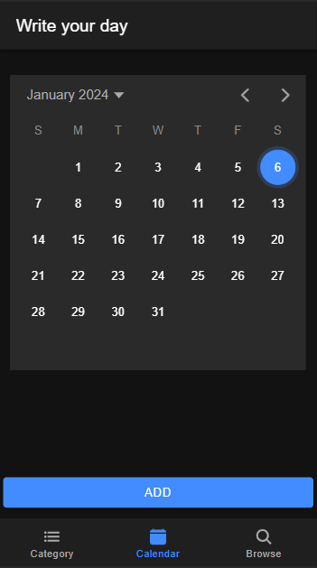
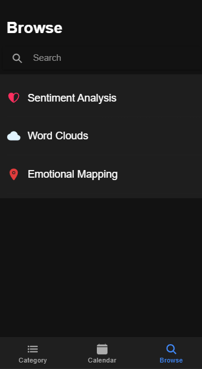

<h1>DayDay</h1>
DayDay is a personal project built using Ionic React. It allows users to create and manage their daily diary entries digitally. 
This README provides information about its features.

<h2>User Interface</h2>
<h3>Home Page</h3>

<h3>Browse Page</h3>

Due to recent Ionic library changes, some of the detailed descriptions are unavailable. Actively resolving compatibility issues for enhanced functionality. 
Stay tuned for updates!

<h2>Features</h2>
<h4>Create Diary Entries</h4> Write and save diary entries for each day.

<h4>Edit and Delete Entries</h4> Edit or delete previously saved diary entries.

<h4>Filter by Categories</h4> Filter diary entries by selecting one or more categories from a list.

<h4>Calendar View</h4> View entries in a calendar format to quickly navigate to specific dates.

<h4>Search</h4> Search for entries based on keywords or dates.

<h4>Word Cloud Visualization</h4> Visualize the most frequently used words in their diary entries.

<h4>Sentiment Analysis</h4> Every diary entry is analyzed for its sentiment, resulting in a score that indicates whether it's positive, negative, or neutral.

<h4>Sentiment Trends</h4> View how your emotions change over time with a visual graph.

<h4>Sentiment by Location</h4> Discover how your emotions vary by location.

<h4>Location Visualization</h4> Visualize sentiment data on maps to explore your emotional patterns geographically.
